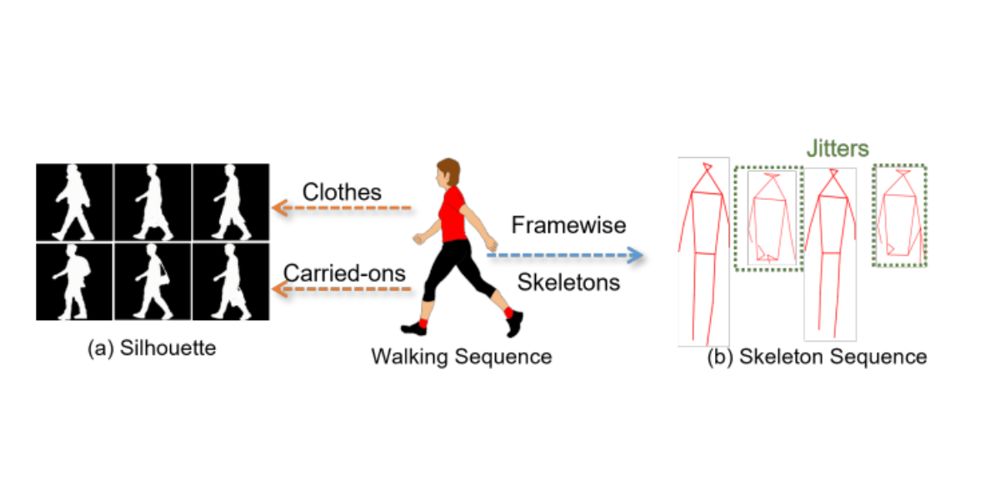

# GaitRef: Gait Recognition with Refined Sequential Skeletons



> **GaitRef: Gait Recognition with Refined Sequential Skeletons** <br>
> Haidong Zhu*, Wanrong Zheng*, Zhaoheng Zheng, and Ram Nevatia <br>
> *IJCB 2023 oral*

[[Paper](https://arxiv.org/pdf/2304.07916.pdf)]
[[Project Page](https://zoeyzheng0.github.io/GaitRef/)]

This work combines the silhouettes and skeletons and refines the framewise joint predictions for gait recognition. With temporal information from the silhouette sequences, we show that the refined skeletons can improve gait recognition performance without extra annotations. We compare our methods on four public datasets, CASIA-B, OUMVLP, Gait3D and GREW, and show state-of-the-art performance.


## BibTeX

```bibtex
@misc{zhu2023gaitref,
      title={GaitRef: Gait Recognition with Refined Sequential Skeletons}, 
      author={Haidong Zhu and Wanrong Zheng and Zhaoheng Zheng and Ram Nevatia},
      year={2023},
      eprint={2304.07916},
      archivePrefix={arXiv},
      primaryClass={cs.CV}
}